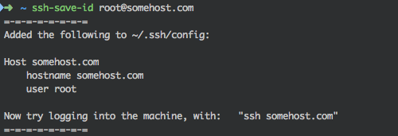

# 

> Already using `ssh-copy-id`? Great! But still manually adding the same configuration info to `~/.ssh/config`? __No more!__

This script creates an easy to remember alias in `~/.ssh/config` based on your input.

## Usage

    $ ssh-save-id root@somehost.com

## Typical use-case

    $ ssh-copy-id root@somehost.com   // copies your public-key to the remote host
    $ ssh-save-id root@somehost.com   // saves an easy to remember alias to ~/.ssh/config
    $ ssh somehost.com                // use the alias to connect to the remote host

## Install

Download the script directly from GitHub:

    $ curl -O https://raw.githubusercontent.com/vjanssens/ssh-save-id/master/ssh-save-id

Then ensure it is executable:

    $ chmod a+x ssh-save-id

Drop it in your `$PATH` __OR__ move it to a default location:

    $ mv ssh-save-id /usr/local/bin/ssh-save-id

And test if it works:

    $ ssh-save-id -h

Do you see the usage instructions as stated below? Great, start saving time!

## Usage instructions

    Usage: ssh-save-id [-h|-n] [-p port] user@hostname
    -n: dry run    -- no aliasses are actually saved
    -h: print this help